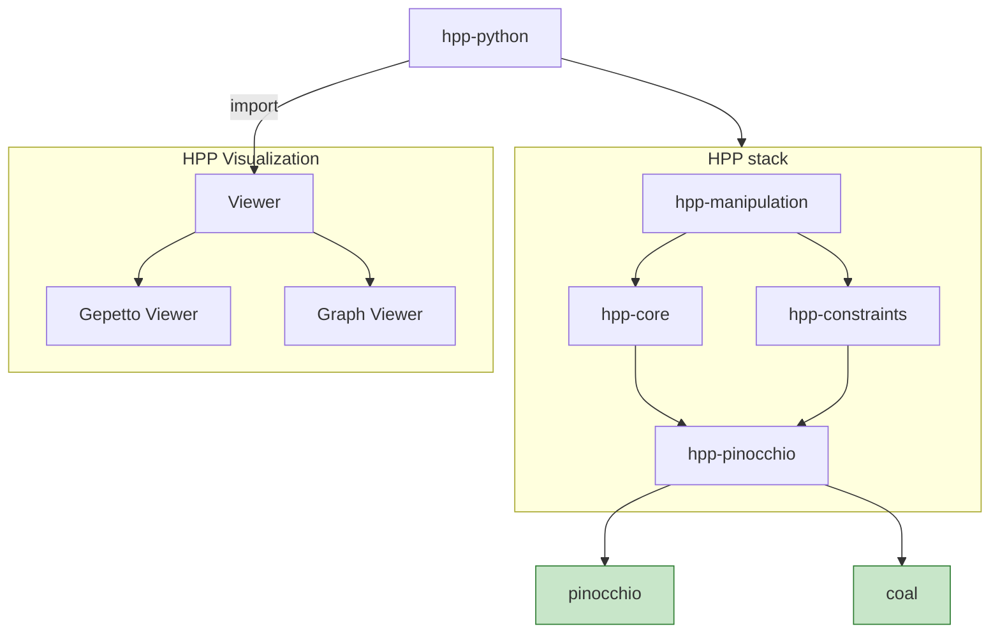

# Humanoid Path Planner Documentation

## Introduction

HPP (Humanoid Path Planner) is a collection of software packages implementing manipulation planning functionalities for diverse types of robots, including humanoid robots.

## Overview of the architecture

The software is composed of C++ libraries implementing the algorithms. Python bindings built on Boost.Python are provided to help users easily define and solve problems. Visualization of the scene can be done in a web browser using [viser](https://viser.studio/main), or using ROS/ROS2 with [rviz2](https://wiki.ros.org/rviz2) or [gazebo](https://gazebosim.org/home) .

The algorithmic part, built on [hpp-manipulation](/reference/hpp-manipulation/) is embedded in several Python modules by [hpp-python](/reference/hpp-python/).

From a Python script, users can define scenes containing robots and environments, they can also define and solve motion planning problems.

Results of path planning requests as well as individual configurations can be displayed in a web browser via package [hpp-gepetto-viewer](@hpp-gepetto-viewer_LINK@).

## Getting started

Package [hpp_tutorial](https://github.com/humanoid-path-planner/hpp_tutorial/tree/devel/README.md) provides some examples of how to use this project. Lets start now ! [Tutorial](/reference/hpp-tutorial/)

