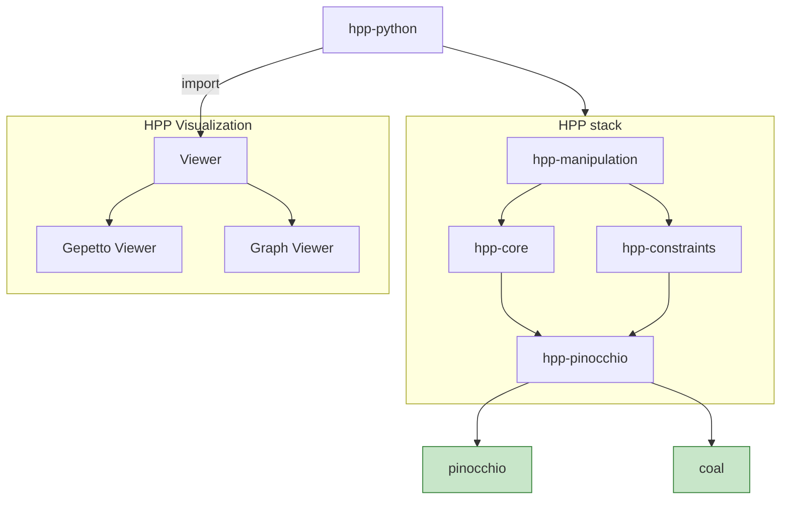

# Humanoid Path Planner Documentation

*A motion planning toolkit for kinematic chains evolving among obstacles — from industrial robot arms to full humanoids.*

## Introduction
HPP is a C++ Software Developement Kit implementing path planning for kinematic chains in environments cluttered with obstacles. Collision checking is performed by a modified version of the Flexible Collision Library developed at University of North Carolina. Robots can be loaded from URDF model. It is a collection of software packages handled by cmake and pkg-config.

## Why HPP?
HPP is not a toy planner: it is built to handle the kind of complex, contact-rich motion planning problems found in real robotics applications.

- **Built for complex kinematic chains** — from single manipulator arms to full humanoids and multi-robot systems.
- **Manipulation planning out of the box** — [hpp-manipulation](/hpp-doc/reference/hpp-manipulation/) handles grasping, regrasping, and multi-contact scenarios, not just collision-free transit paths.
- **Fast, reliable collision checking** — powered by a modified Flexible Collision Library (coal) under [hpp-pinocchio](/hpp-doc/reference/hpp-pinocchio/).
- **Python-first workflow** — define scenes, robots, and planning problems from simple Python scripts via [hpp-python](/hpp-doc/reference/hpp-python/), with the heavy algorithmic lifting handled in C++.
- **Flexible visualization** — watch your robot plan and move in a web browser with [viser](https://viser.studio/main), or plug into your existing ROS/ROS2 setup with [rviz2](https://wiki.ros.org/rviz2) or [gazebo](https://gazebosim.org/home).
- **Battle-tested on real industrial use cases** — surface treatment, welding, and assembly tasks, as shown below.

## Applications
HPP is already used to plan motions for real industrial robotic tasks — here are a few examples in action.

### Surface treatment
Planning a tool path to sweep and abrade the surface of a cylinder, while avoiding self-collisions and obstacles in the workspace.

<iframe title="Sweeping a surface on a cylinder with an abrasion tool" width="560" height="315" src="https://peertube.laas.fr/videos/embed/hSHX1HZ2icsVMgwuw95jYk" style="border: 0px;" allow="fullscreen" sandbox="allow-same-origin allow-scripts allow-popups allow-forms"></iframe>

### Welding
Planning collision-free trajectories for a welding tool around complex parts.

<iframe title="welding" width="560" height="315" src="https://peertube.laas.fr/videos/embed/2vHankanje9jfRRXTGXyXA" style="border: 0px;" allow="fullscreen" sandbox="allow-same-origin allow-scripts allow-popups allow-forms"></iframe>

### Assembly / construction
Planning manipulation sequences to assemble a structure piece by piece, combining grasping, regrasping, and placement.

<iframe width="560" height="315"
title="construction set"
src="https://www.youtube.com/embed/ZVvePCl6qP0"
style="border: 0px;" allow="fullscreen" sandbox="allow-same-origin allow-scripts allow-popups allow-forms">
</iframe>

## Overview of the architecture

The software is composed of C++ libraries implementing the algorithms. Python bindings built on Boost.Python are provided to help users easily define and solve problems. Visualization of the scene can be done in a web browser using [viser](https://viser.studio/main), or using ROS/ROS2 with [rviz2](https://wiki.ros.org/rviz2) or [gazebo](https://gazebosim.org/home).

The algorithmic part, built on [hpp-manipulation](/hpp-doc/reference/hpp-manipulation/) is embedded in several Python modules by [hpp-python](/hpp-doc/reference/hpp-python/).
From a Python script, users can define scenes containing robots and environments, they can also define and solve motion planning problems.
Results of path planning requests as well as individual configurations can be displayed in a web browser via package [hpp-gepetto-viewer](@hpp-gepetto-viewer_LINK@).

## Getting started
Package [hpp_tutorial](https://github.com/humanoid-path-planner/hpp_tutorial/tree/devel/README.md) provides some examples of how to use this project. Lets start now ! [Tutorial](/hpp-doc/reference/hpp-tutorial/)

## Acknowledgement

## Contributors

Thanks to all the contributors of the HPP project:

