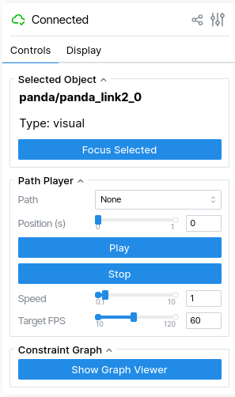
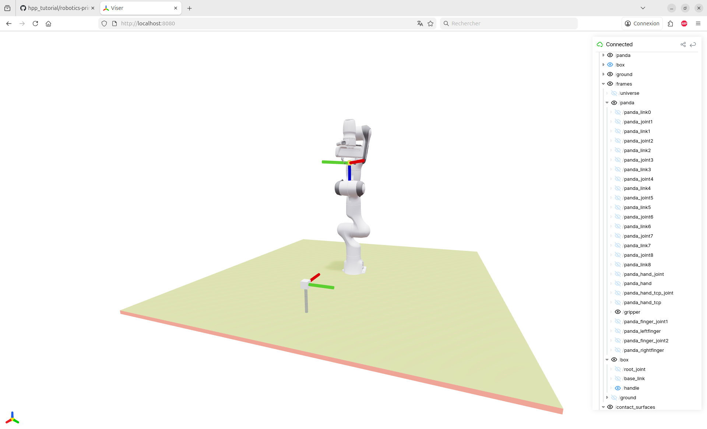
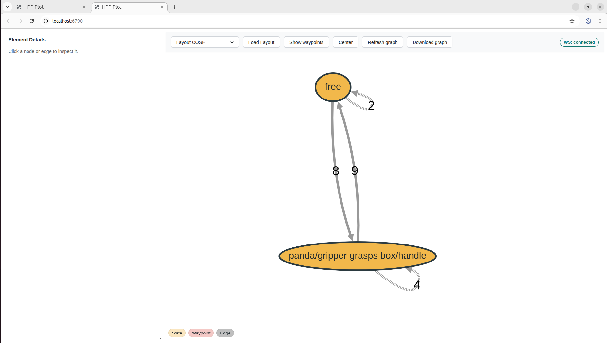
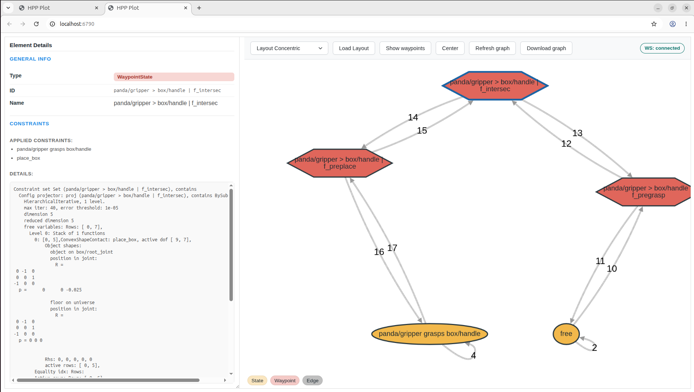

# Solving a simple pick and place task with HPP

This tutorial will help you defining and solving a simple pick and place task with a franka robot.

## Prerequisite

Having installed HPP by following the steps described in [tutorial 1](../tutorial_1/).

## Resources

  The main concepts and theory implemented in HPP software are described in the following paper: https://laas.hal.science/hal-02995125v2.

  You can access the C++ online API documentation [here](https://gepetto.github.io/doc/hpp-doc/doxygen-html/index.html)

## Starting the container and opening new terminals

To open again the container, in the same directory as in [tutorial 1](../tutorial_1/), simply run the command

```
./run_docker.sh
```
Then in another terminal, type
```
docker exec -it hpp bash
```
This will open another bash terminal in the container. You can do this as many times as you want to open new terminals in the container.

In the new terminal, open `midori` web browser:
```
midori
```

## Building and displaying a robot

In the first terminal, go into directory `hpp_tutorial/tutorial_2` and run the following python script
```
cd /home/user/devel/src/hpp_tutorial/tutorial_2
python -i init.py
```
You are now in an interactive python terminal. To display the robot that has been loaded by the script, type
```
v = Viewer(robot)
v.initViewer(open=False, loadModel=True)
v(q)
```
Then in midori address bar, type `http://localhost:8080`. You should see the panda robot.

You can have a quick look at the script to see the instructions used to define the robot.

## Adding an obstacle to the scene

In the python terminal, copy-paste the following instructions
```
urdf_filename = "package://hpp_tutorial/urdf/ground.urdf"
srdf_filename = "package://hpp_tutorial/srdf/ground.srdf"
urdf.loadModel(robot, 0, "ground", "anchor", urdf_filename, srdf_filename, SE3.Identity())
v = Viewer(robot)
v.initViewer(open=False, loadModel=True)
v(q)
```

## Adding an object to the scene

In the python terminal, copy-paste the following instructions
```
urdf_filename = "package://hpp_tutorial/urdf/box.urdf"
srdf_filename = "package://hpp_tutorial/srdf/box.srdf"
urdf.loadModel(robot, 0, "box", "freeflyer", urdf_filename, srdf_filename, SE3.Identity())
q = neutral(robot.model())
q[7:9] = [0.035, 0.035]
q[9:12] = [.4, -0.2, 0.025]
v = Viewer(robot)
v.initViewer(open=False, loadModel=True)
v(q)
```

### Setting bounds to the object translation

Latter on, we will uniformly sample random configurations. To make it possible, we need to set bounds to the translation of the object.
```
robot.setJointBounds("box/root_joint", [-1.5, 1.5,
    -1.5, 1.5,
    -0.2, 1.5,
    -float("Inf"), float("Inf"),
    -float("Inf"), float("Inf"),
    -float("Inf"), float("Inf"),
    -float("Inf"), float("Inf")])
```
The first six values are the minimal and maximal values along x, y, z axes. The eight last
values apply to the quaternion coefficients that need not being bounded.

## Explaining the code

Let us have a quick look at the code in `init.py`.
```
robot = Device("tuto")
```
This line creates an empty robot implementing
  - a `pinocchio` model for the kinematic chain,
  - a `pinocchio` geometric model for collision, and
  - a `pinocchio` geometric model for visual display.

The following lines populate the kinematic chain with a panda robot:
```
urdf_filename = "package://example-robot-data/robots/panda_description/urdf/panda.urdf"
srdf_filename = "package://hpp_tutorial/srdf/panda.srdf"

urdf.loadModel(robot, 0, "panda", "anchor", urdf_filename, srdf_filename, SE3.Identity())
```
The arguments of the latter functions are the following:
  - `robot`: the kinematic chain to which the new robot will be appended,
  - `0`: the index of the frame to which the new robot is appended (here the world frame),
  - `"anchor"`: the type of mobility of the new robot `base_link` (here the robot is fixed to the environment),
  - `urdf_filename`: URDF file that describes the new robot,
  - `srdf_filename`: SRDF file that adds some information about the new robot, like collision pairs, and some information we will explain later on,
  - `SE3.Identity()` pose of the new robot in the world frame.

The following lines of code retrieve the neutral configuration of the robot (all joint set to 0) and open the gripper of the panda.
```
# Get neutral configuration of robot
q = neutral(robot.model())
# Open the gripper
q[-2:] = [0.035, 0.035]
```
Note that adding the ground and a box use the same function. The box is added with "freeflyer" as the mobility type. Therefore, the box is part of the kinematic chain and `neutral` returns a vector of dimension 16 (9 for the panda, 7 for the box).

## Explaining the SRDF files

SRDF follows the xml syntax. Some specific tags are parsed by HPP to add information to the robot and object models. Let us now have a look at the srdf files that are used above by function `urdf.loadModel` Note that all srdf files used above can be found in the `srdf` directory of the package.

In file `panda.srdf`,
```
    <!-- gripper -->
    <gripper name="gripper" clearance="0.05">
      <position xyz="0 0 0" wxyz="1 0 0 0" />
      <link name="panda_hand_tcp"/>
    </gripper>
```
defines a gripper, that is a frame attached to link `panda_hand_tcp`. The relative pose of the frame with respect to the link is defined by tag `position`. Attribute `xyz` defines the translation, attribute `wxyz` defines the rotation as a unit quaternion with real part in first position.
Attribute `clearance` will be used later on to define pregrasp configurations.

In file `box.srdf`,
```
  <handle name="handle" clearance="0.025" approaching_direction="0 0 1">
    <position xyz="0 0 0" wxyz="0 0 1 0" />
    <link name="base_link"/>
  </handle>
```
defines a handle, that is a frame attached to link `base_link`. he relative pose of the frame with respect to the link is defined by tag `position`. Note that the z axis of the handle points downwards when the object is placed on a horizontal contact surface. Tag `approaching_direction` will be used by used later on by the constraint graph factory to generate pregrasp states.
```
  <contact name="surface">
    <link name="base_link"/>
    <point>-0.025 -0.025 -0.025   -0.025 0.025 -0.025   0.025 0.025 -0.025   0.025 -0.025 -0.025
    </point>
    <shape> 4 0 1 2 3</shape>
  </contact>
```
defines a contact surface used to define stable poses of the object. The surface is a plane polygon defined by the vertices (`point` tag). Here we define 1 polygon with 4 vertices in order `0 1 2 3` (`shape` tag).

Note that `box.srdf` also defines a contact surface. The box is in stable contact pose when the contact surfaces are coplanar with opposite normal and the center of the box surface is included in the polygonal surface of the ground.

## A quick tour of the viewer

In the upper right corner of the viewer, there is the following window to control the view. We call this window the **view controller**.



Move the mouse to the icon representing three vertical sliders in the upper right corner, "Configuration and diagnostics" should pop up. Click on the icon and you will see the scene tree. Clicking again brings you back to the initial widget. Select tab "Display" in the upper part of the view controller and select "Show Visuals", "Show Frames" and "Show Contact Surfaces". Many frames are displayed, as well as the contact surfaces defined in the SRDF files.

Go again to the scene tree. In the tree, expand "pinocchio" then "frames", then "panda". By clicking on the eye in front of each node, you remove the corresponding frame from the view. Remove them all except "panda/gripper" and "box/handle". You now see the gripper and handle frames that will define how the robot grasps the object as in the picture below.



## Defining a manipulation problem

The manipulation problem is defined through a variable of type `Problem` and through the constraint graph that will be constructed by a factory. Let us define those variables.
```
from pyhpp.manipulation import (Graph, Problem, ManipulationPlanner)
from pyhpp.manipulation.constraint_graph_factory import ConstraintGraphFactory

problem = Problem(robot)
graph = Graph("robot", robot, problem)
factory = ConstraintGraphFactory(graph)
```
Later on the graph will solve numerical constraints. We need to set the error threshold and the maximal number of iterations.
```
graph.maxIterations(40)
graph.errorThreshold(1e-5)
```
Then, we need to define the set of grippers that will be used.
```
factory.setGrippers(["panda/gripper"])
```
We also define the list of objects and for each of them, the list of handles and the list of contact surfaces.
```
objects = ["box"]
handlesPerObject = [["box/handle"]]
contactsPerObject = [["box/surface"]]
factory.setObjects(objects, handlesPerObject, contactsPerObject)
```
Finally, we define the set of environment contact surfaces (surfaces on which objects may be placed).
```
factory.environmentContacts(["ground/surface"])
```
Then we ask the factory to generate the constraint graph corresponding to the manipulation problem.
```
factory.generate()
```
Before initializing the graph, we will add a constraint to all states and transitions in order to keep the gripper open all the time.
```
import numpy as np
from pyhpp.constraints import (ComparisonType, ComparisonTypes, LockedJoint)
cts = ComparisonTypes()
cts[:] = [ComparisonType.EqualToZero]
lockedFingers = list()
for i in range(2):
    lj = LockedJoint(robot, f'panda/panda_finger_joint{i+1}', np.array([0.035]), cts)
    lockedFingers.append(lj)

graph.addNumericalConstraintsToGraph(lockedFingers)
graph.initialize()
```

### Displaying the constraint graph

In the python terminal, copy paste the following lines
```
v.setProblem(problem)
v.setGraph(graph)
```
In the view controller, click on the button "Show Graph Viewer". The window below should appear.


This window displays the constraint graph.

If you click on show waypoints, you will see **waypoint states** as on the picture below. Those intermediate states ease manipulation planning by forcing the robot to approach the object from above and lift it above the ground before moving it. The distance of the gripper to the object in **pregrasp** state is the sum of the gripper and handle clearances defined in the SRDF files.



By clicking on a state, you can display the constraints of this state. By right clicking on a state, you can select "Generate random config" and figure out what the additional states are meant for. Note that this operation may fail if the numerical solver does not converge and that it does not care for collisions.

### Back to the manipulation problem

To define a manipulation problem, we now simply need to set the initial and goal configurations. To do so, we move the robot in a collision-free configuration and change only the pose of the box between those configurations
```
q_init = np.array([ 0.   ,  0.   ,  0.   , -0.5  ,  0.   ,  0.5  ,  0.   ,  0.035,
        0.035,  0.4  , -0.2  ,  0.0251,  0.   ,  0.   ,  0.   ,  1.   ])
q_goal = np.array([ 0.   ,  0.   ,  0.   , -0.5  ,  0.   ,  0.5  ,  0.   ,  0.035,
        0.035,  0.4  ,  0.2  ,  0.0251,  0.   ,  0.   ,  0.   ,  1.   ])
```
You can display these configurations with
```
v(q_init)
v(q_goal)
```

## Solving the manipulation problem

To define and solve the problem,
```
from pyhpp.manipulation import ManipulationPlanner
problem.initConfig(q_init)
problem.addGoalConfig(q_goal)
problem.constraintGraph(graph)
manipulationPlanner = ManipulationPlanner(problem)
manipulationPlanner.maxIterations(500)
p = manipulationPlanner.solve()
```

### Displaying the resulting path

You can display the resulting path in the graphical interface by first loading it
```
v.loadPath(p)
```
and then by clicking on "Play" in the view controller.

## optimizing paths

Random sampling method usually compute paths that are far from being optimal. These paths can be post-processed to make them shorter.

```
from pyhpp.core import RandomShortcut
optimizer = RandomShortcut(problem)
p1 = optimizer.optimize(p)
```
