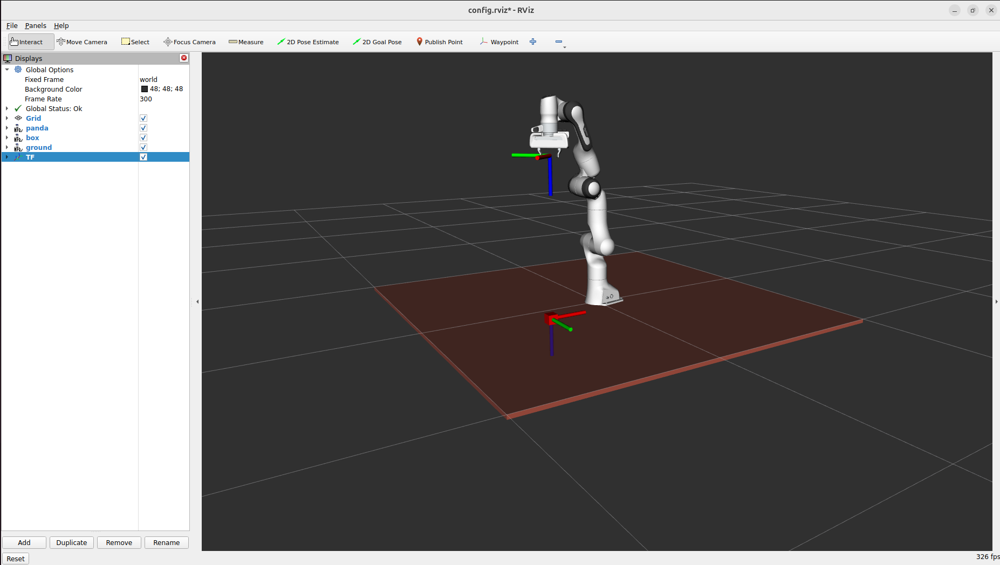
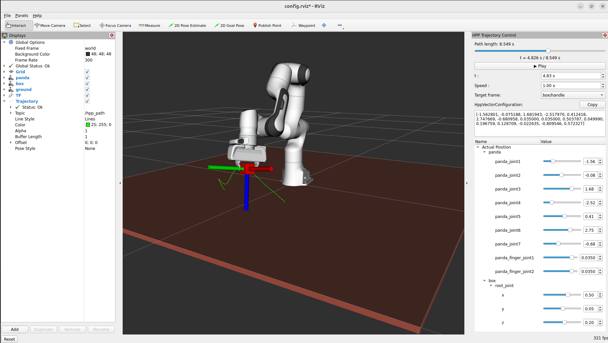

# How to use a rviz2 visualization

## Prerequisite

Having completed [tutorial 2](../tutorial_2/).

## Overview

This tutorial shows how to set up an RViz2 visualization for HPP using the `RVizVisualizer`
from `pyhpp_rviz`. Unlike the web-based viewer used in tutorials 2–5, this visualizer
communicates over ROS 2 topics and displays the robot, paths, and landmarks directly inside
RViz2.

## Setting up the simulation

The base tutorial docker image does not include ROS 2 control packages. Build the
extended image from the tutorial 6 directory **on the host machine** (not inside
the container):

```
cd tutorial_6
docker build --build-arg DOCKER_USER=`id -u` --build-arg DOCKER_GROUP=`id -g` \
    -t hpp-ros2:tuto .
```

Then start the container from the root shared directory:

```
cd ../../..
./src/hpp_tutorial/tutorial_6/run_docker.sh
```

## Compiling the HPP RViz2 plugins

On your first `make all` from tutorial 1, the RViz2 plugin sources were notcompiled.
Build `hpp-rviz`:

```
cd src
make hpp-rviz.install
```

export the package path

```bash
export ROS_PACKAGE_PATH=/home/user/devel/src/:/opt/openrobots/share/:$ROS_PACKAGE_PATH
```

## Initializing the viewer

In the docker container, cd into `tutorial_6` directory and run:

```
python -i init.py
```

The script is identical to tutorial 2 up to the computation of path `p`
The only difference is that it uses `RVizVisualizer` instead of `viser Viewer`.

```python
from pyhpp_rviz import RVizVisualizer as Viewer

v = Viewer()
v.initViewer(robot=robot)

```

## Configuring RViz2

Open a second terminal in the container:

```
docker exec -it hpp bash
rviz2
```

In RViz2, set the **Fixed Frame** to `world` (in the *Global Options* panel).

Set the Frame Rate to 300

For each model loaded with `urdf.loadModel`, add a **RobotModel** display and set its
`Description Topic` to the topic published for that model (e.g. `/panda/robot_description`,
`/ground/robot_description`, `/box/robot_description`). The prefix matches the name
passed to `urdf.loadModel`.

Add a **TF** display to visualize all frame transforms published by the viewer.

Disable TF arrows and put Frame Time Out to 1e+07

There is a rviz config file on hpp_tutorial/launch/tuto6.rviz
```bash
rviz2 -d hpp_tutorial/launch/config.rviz
```

Call `v(q_init)` in the Python terminal to place all objects in their initial configuration.
The scene should now appear in RViz2.



## Visualizing a configuration

```python
v(q_init)
```
Use v(config) to display a configuration on rviz2 like is done with viser.

## Visualizing a path

Add the **Trajectory** plugin (from the HPP RViz2 plugins) to RViz2. A control panel
will appear at the bottom of the screen.


Load a path from the Python terminal:

```python
v.loadPath(path)
```

The panel lets you slide through the path parameter to inspect any intermediate configuration.

To display the spatial trace of a frame along the path, use:

```python
v.displayPath(path, target_frame="panda/gripper")
```

You can also trigger this from RViz2 by entering the frame name directly in the
DisplayTrajectory panel.




## Adding landmarks

Add the **Landmark** tool from the RViz2 toolbar (installed with the HPP RViz2 plugins).
Add the **Landmark** display to visualize the landmarks in the scene.

Landmarks can be placed in three ways:

- **Interactively**: select the Landmark tool in the toolbar, then click in the 3D view.
  Drag the landmark with the interact tool for moving it or
  Right-click a landmark marker and choose *Edit position* to adjust it numerically with the interact tool too

- **From a named frame** (Python):
  ```python
  v.addLandmarkFromFrame("panda/gripper", "first landmark")
  ```
  This publishes the current pose of the given frame as a landmark.

- **From explicit coordinates** (Python):
  ```python
  v.addLandmark(xyz=[0.8, 0.0, 1.0], quat_xyzw=[0.0, 0.0, 0.0, 1.0], "landmark")
  ```


## Summary of viewer methods

| Method | Description |
|---|---|
| `v(q)` | Display configuration `q` |
| `v.loadPath(p)` | Register path `p` for trajectory control |
| `v.displayPath(p, target_frame=...)` | Publish the spatial trace of a frame along `p` |
| `v.addLandmarkFromFrame(frame)` | Publish current pose of `frame` as a landmark |
| `v.addLandmark(xyz, quat_xyzw)` | Publish an explicit pose as a landmark |
| `v.setProblem(problem)` | Register problem for graph viewer |
| `v.setGraph(graph)` | Register constraint graph for graph viewer |
| `v.launch_graph_viewer()` | Open the constraint graph viewer (React app) |
